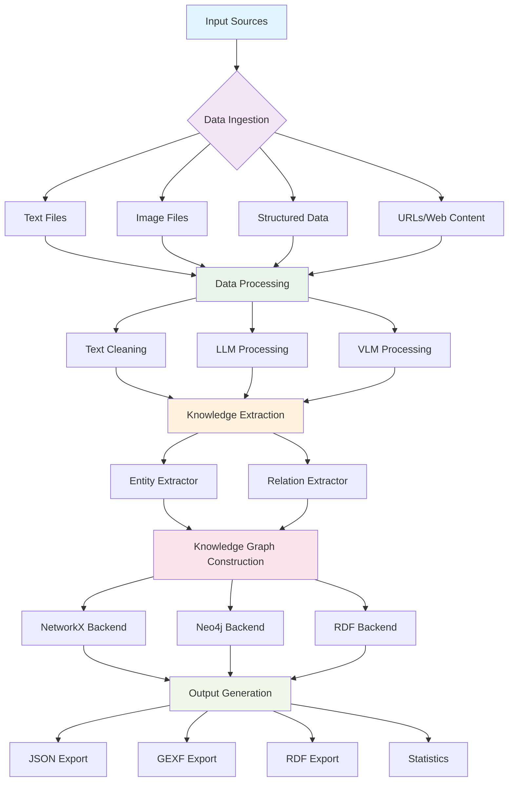

# AI-FS-KG-Gen

A large-scale multi-source heterogeneous food safety knowledge graph generation pipeline using advanced AI technologies including Large Language Models (LLM), Vision Language Models (VLM), and Knowledge Graph (KG) techniques.

## 🔄 Pipeline Overview

The AI-FS-KG-Gen pipeline transforms multi-source food safety data into structured knowledge graphs through a comprehensive 5-stage process:



## 🏗️ Architecture Components

### 1. 📥 Data Ingestion Layer
- **Text Loader**: Processes text files (TXT, PDF, HTML, Markdown)
- **Image Loader**: Handles image files (JPEG, PNG, TIFF, etc.)
- **Structured Data Loader**: Manages structured data (CSV, JSON, Excel)
- **URL Ingestion**: Fetches content from web sources

### 2. 🧠 Data Processing Layer
- **Text Cleaner**: Normalizes and preprocesses text data
- **LLM Processor**: Leverages Large Language Models for:
  - Text summarization and classification
  - Entity and relation extraction
  - Knowledge generation
- **VLM Processor**: Uses Vision-Language Models for:
  - Image captioning and analysis
  - Food safety visual assessment

### 3. 🔍 Knowledge Extraction Layer
- **Entity Extractor**: Identifies food safety entities:
  - Food products and ingredients
  - Pathogens and microorganisms
  - Chemical compounds and allergens
  - Safety standards and regulations
- **Relation Extractor**: Discovers relationships:
  - Contains/composition relations
  - Causal relationships (causes/prevents)
  - Regulatory compliance
  - Processing relationships

### 4. 🕸️ Knowledge Graph Layer
- **Multi-backend Support**:
  - **NetworkX**: In-memory graphs for analysis
  - **Neo4j**: Scalable graph database
  - **RDF**: Semantic web standards
- **Graph Operations**: Entity resolution, relation validation, graph merging

### 5. 🎯 Pipeline Orchestration
- **Configuration Management**: Flexible settings and parameters
- **Parallel Processing**: Multi-threaded execution
- **Result Management**: Comprehensive output generation
- **Error Handling**: Robust error recovery and logging

## 🚀 Features

- **🔗 Multi-source Data Ingestion**: Support for text, image, and structured data sources
- **🤖 AI-powered Processing**: Integration with LLMs for text understanding and VLMs for image analysis
- **🎯 Knowledge Extraction**: Automated entity and relationship extraction from diverse data sources
- **📊 Knowledge Graph Construction**: Building and managing large-scale food safety knowledge graphs
- **⚡ Pipeline Orchestration**: Coordinated workflow for end-to-end KG generation
- **🔧 Configurable Backends**: Support for NetworkX, Neo4j, and RDF
- **📈 Comprehensive Logging**: Detailed execution tracking and monitoring
- **🔄 Batch Processing**: Efficient handling of large datasets

## 📦 Installation

### Basic Installation
```bash
# Clone the repository
git clone https://github.com/576469377/AI-FS-KG-Gen.git
cd AI-FS-KG-Gen

# Install core dependencies
pip install -r requirements.txt
```

### Optional Dependencies
```bash
# For advanced LLM features (requires API keys)
pip install openai transformers torch

# For enhanced NLP capabilities
pip install spacy
python -m spacy download en_core_web_sm

# For graph database support
pip install neo4j py2neo
```

## 🏃‍♂️ Quick Start

### Basic Pipeline Example
```bash
# Run basic pipeline with sample data
python examples/basic_pipeline.py
```

### Python API Usage
```python
from pipeline import AIFSKGPipeline, PipelineConfig

# Create configuration
config = PipelineConfig(
    input_sources=["path/to/your/data"],
    input_types=["text", "image", "structured"],
    use_llm=False,  # Set to True if you have API keys
    use_vlm=False,  # Set to True for image processing
    entity_extraction=True,
    relation_extraction=True,
    kg_backend="networkx",
    kg_output_format="json"
)

# Run pipeline
pipeline = AIFSKGPipeline(config)
results = pipeline.run()

# Access results
print(f"Extracted {results['statistics']['total_entities']} entities")
print(f"Found {results['statistics']['total_relations']} relations")
```

## 📊 Output Examples

The pipeline generates comprehensive outputs including:

- **Knowledge Graph**: Structured representation of food safety knowledge
- **Entity Lists**: Categorized entities (microorganisms, food products, etc.)
- **Relation Networks**: Relationships between entities
- **Statistics**: Processing metrics and graph statistics
- **Visualizations**: Graph visualizations (when applicable)

## ⚙️ Configuration

### Pipeline Configuration
```python
config = PipelineConfig(
    # Input settings
    input_sources=["data/", "urls.txt"],
    input_types=["text", "image", "structured"],
    
    # AI model settings
    use_llm=True,
    use_vlm=True,
    llm_model="gpt-3.5-turbo",
    vlm_model="blip-base",
    
    # Extraction settings
    entity_confidence_threshold=0.6,
    relation_confidence_threshold=0.6,
    
    # Backend settings
    kg_backend="networkx",  # or "neo4j", "rdf"
    kg_output_format="json",  # or "gexf", "rdf"
    
    # Performance settings
    max_workers=4,
    batch_size=10
)
```

### Supported AI Models

#### Large Language Models (LLMs)
- **OpenAI Models**: GPT-3.5-turbo, GPT-4, GPT-4-turbo
- **Hugging Face Models**: LLaMA 2, Mistral, Code Llama, Flan-T5
- **Local Models**: Any Hugging Face compatible model

#### Vision-Language Models (VLMs)
- **BLIP Models**: Base and Large variants for image captioning
- **CLIP Models**: For zero-shot image classification
- **LLaVA**: For advanced visual reasoning

#### Model Selection Guide
- **Development**: GPT-3.5-turbo + BLIP-base (fast, cost-effective)
- **Production**: GPT-4 + BLIP-large (high accuracy)
- **Privacy-First**: Local Hugging Face models (no external API calls)
- **Budget-Conscious**: Local smaller models or limited API usage

> 📖 **For detailed model setup and configuration, see our [Model Support Guide](docs/model_support.md) and [LLM Integration Guide](docs/llm_integration.md)**

### Environment Variables
```bash
# For LLM functionality
export OPENAI_API_KEY="your-openai-api-key"

# For Neo4j backend
export NEO4J_URI="bolt://localhost:7687"
export NEO4J_USER="neo4j"
export NEO4J_PASSWORD="password"

# For local model caching
export TRANSFORMERS_CACHE="./model_cache"
```

## 📚 Documentation

### Quick Start
- [🚀 Quick Start Guide](docs/quick_start.md) - **Start here!** Choose your deployment scenario and get running in minutes

### Core Documentation
- [📖 Architecture Overview](docs/architecture.md) - System design and components
- [📘 Usage Guide](docs/usage.md) - How to use the pipeline
- [🔧 API Reference](docs/api.md) - Complete API documentation

### Model Integration & Support
- [🤖 Model Support Guide](docs/model_support.md) - Complete overview of supported AI models
- [⚡ LLM Integration Guide](docs/llm_integration.md) - Step-by-step LLM setup and configuration
- [⚙️ Configuration Examples](docs/configuration_examples.md) - Real-world deployment scenarios
- [🔧 Troubleshooting Guide](docs/troubleshooting.md) - Common issues and solutions

## 🧪 Testing

```bash
# Run basic functionality tests
python test_basic.py

# Run comprehensive tests (requires pytest)
pytest tests/
```

## 🤝 Contributing

We welcome contributions! Please see our [Contributing Guidelines](CONTRIBUTING.md) for details.

## 📄 License

This project is licensed under the MIT License - see the [LICENSE](LICENSE) file for details.

## 🙏 Acknowledgments

- Built with ❤️ for the food safety research community
- Powered by state-of-the-art AI and knowledge graph technologies
- Special thanks to all contributors and researchers in food safety informatics